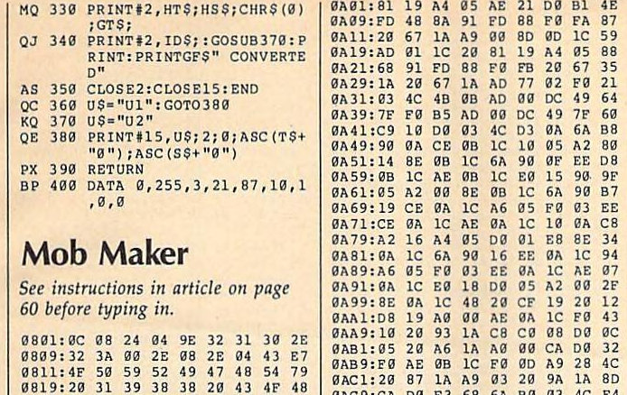

In _IEEE Computer magazine_ of March 1998 the original developer or Tcl/TK, John Ousterhout,
[wrote](http://www.tcl.tk/doc/scripting.html):

> Scripting languages are designed for _gluing_ applications; they use
> typeless approaches to achieve a higher level of programming and more
> rapid application development than system programming languages.
> Increases in computer speed and changes in the application mix are
> making scripting languages more and more important for applications of
> the future.

I think that more than 20 years later we can confirm that Ousterhout was right. Programming has been transformed from writing everything yourself from scratch, to finding the right components, configuring them and combining them with some code of your own. And, although strongly typed and compiled languages like Java and C# persist, scripting languages like Javascript and Python [top](https://octoverse.github.com/#top-languages) the [charts](https://insights.stackoverflow.com/survey/2019#most-popular-technologies).

When I learned to program (_oldtimer speaking_), there was no Internet. If I wanted to use code written by others, I bought a magazine and painstakingly copied the printed code into my trusted [C64](https://codeincomplete.com/posts/c64-manual-nostalgia/). And when I say "copy", I do not mean `cp file.bas`, but [typing](https://en.wikipedia.org/wiki/Type-in_program) the code one character at a time. When I was really 'lucky' I had to type long lists of meaningless numbers representing machine code. The result would be blazing fast, but hardly ever worked, because typos were almost inevitable.

To me, the biggest innovation in programming of the last decade is package managers like [pipenv](https://pipenv.kennethreitz.org/) and [yarn](https://yarnpkg.com/), which make finding, installing and maintaining packages a breeze. And to top it off, documentation has improved dramatically over the last couple of years.